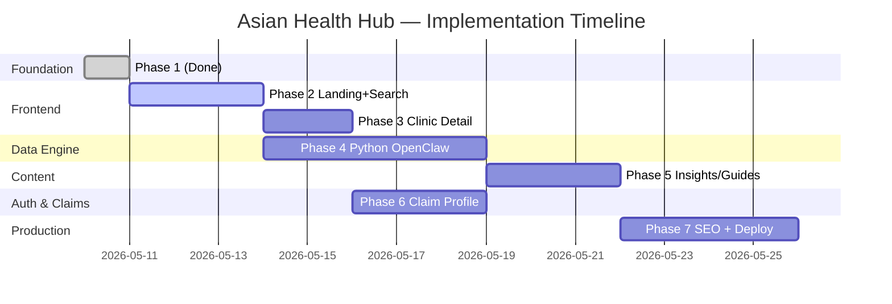

# Asian Health Hub — Toàn bộ Implementation Plan

> Kế hoạch triển khai chi tiết từ Phase 1 (đã xong) đến Phase 7 (Production). Mỗi Phase có thể thực thi trong 1-3 sessions.

## Trạng thái Hiện tại

| Đã hoàn thành | File |
|---|---|
| ✅ Next.js 16 + React 19 + App Router + TypeScript strict | Project root |
| ✅ ShadcnUI + Tailwind CSS v4 | `components.json`, `globals.css` |
| ✅ DB Schema: `organizations`, `clinics`, `articles`, `article_facts` + RLS | `supabase/schema.sql` |
| ✅ Supabase clients (browser + server) | `src/lib/supabase/` |
| ✅ TypeScript types (mirror schema) | `src/types/database.ts` |
| ✅ Service layer: `searchClinics`, `getClinicById` | `src/services/clinic-service.ts` |
| ✅ Phase 2 UI: Home, search, filters, clinic cards, pagination | `src/app/page.tsx`, `src/app/search/page.tsx` |
| ✅ Phase 3 scaffold: clinic detail by slug + profile sections | `src/app/clinics/[slug]/page.tsx` |
| ✅ Phase 4 scaffold: OpenClaw search/scrape/extract/upsert scripts | `openclaw/` |
| 🔄 Phase 5 active: Insights listing/detail, article service, content generator | `src/app/insights/`, `openclaw/generate_insights.py` |
| ✅ Tài liệu: README, PIPELINE, ARCHITECTURE | Root `.md` files |

---

## Phase 2: Landing Page + Search UI

> **Mục tiêu**: Trang chủ "WOW" + trang tìm kiếm phòng khám hoạt động được.

### 2.1 Landing Page (Trang chủ)

#### [NEW] `src/components/layout/header.tsx`
- Logo "Asian Health Hub" + Navigation bar
- Links: Home, Search, Insights, For Providers
- Mobile hamburger menu (responsive)
- Server Component

#### [NEW] `src/components/layout/footer.tsx`
- Copyright, links, social media icons
- Language switcher placeholder (EN/VI/KO)

#### [MODIFY] `src/app/layout.tsx`
- Wrap children với Header + Footer
- Import Google Fonts (Inter / Outfit)
- Set metadata: title, description, Open Graph

#### [MODIFY] `src/app/page.tsx`
- **Hero Section**: Headline "Find Healthcare Providers Who Speak Your Language" + search bar CTA
- **How It Works**: 3-step visual (Search → Filter → Connect)
- **Stats Section**: "10,000+ Providers • 15+ Languages • 50 States"
- **Featured Cities**: San Jose, Houston, Los Angeles, New York cards
- **CTA Section**: "Are you a provider? Claim your profile"

#### [NEW] `src/components/home/hero-search.tsx` (`'use client'`)
- Search bar với 3 dropdowns: Specialty, City, Language
- Submit → redirect sang `/search?specialty=X&city=Y&language=Z`
- Autocomplete/suggestions (phase sau, đầu tiên dùng static lists)

#### [NEW] `src/components/home/city-card.tsx`
- Card hiển thị thành phố phổ biến + số lượng phòng khám
- Gradient background, hover animation

#### [MODIFY] `src/app/globals.css`
- Custom CSS variables cho brand colors
- Animation keyframes (fade-in, slide-up)
- Typography scale

---

### 2.2 Search Page (Trang tìm kiếm)

#### [NEW] `src/app/search/page.tsx` (Server Component)
- Đọc `searchParams` từ URL
- Gọi `searchClinics()` service
- Render: FilterSidebar + ClinicList + Pagination
- SEO metadata động: "Vietnamese Dentists in San Jose | Asian Health Hub"

#### [NEW] `src/components/search/filter-sidebar.tsx` (`'use client'`)
- Filters: Specialty (dropdown), City (input), State (dropdown), Language (multi-select)
- "Apply Filters" button → update URL searchParams
- Sử dụng ShadcnUI: `Select`, `Input`, `Button`, `Checkbox`

#### [NEW] `src/components/search/clinic-card.tsx`
- Hiển thị: Name, Specialty, Address, Languages (badges), Rating stars, Phone
- Click → link sang `/clinics/[id]`
- ShadcnUI `Card` + `Badge`

#### [NEW] `src/components/search/clinic-list.tsx`
- Map qua danh sách clinics → render `ClinicCard`
- Empty state: "No clinics found. Try different filters."
- Loading skeleton

#### [NEW] `src/components/search/pagination.tsx` (`'use client'`)
- Previous / Next + page numbers
- Update URL `?page=N`
- ShadcnUI `Pagination`

#### [NEW] `src/app/api/search/route.ts` (Route Handler)
- `GET /api/search?city=X&specialty=Y&language=Z&page=1`
- Gọi `searchClinics()` → trả JSON
- Cho Client Components fetch khi user thay đổi filter mà không reload page

### 2.2.1 ShadcnUI Components cần cài thêm
```bash
npx shadcn@latest add card badge input select checkbox separator pagination skeleton
```

---

### 2.3 Seed Data (Để test UI)

#### [NEW] `supabase/seed.sql`
- Insert 20-30 bản ghi mẫu vào `clinics` table
- Đa dạng: Vietnamese/Korean/Chinese, nhiều cities (San Jose, Houston, LA)
- Metadata mẫu: reviews, working_hours, rating

---

## Phase 3: Clinic Detail Page + Map

> **Mục tiêu**: Trang chi tiết phòng khám với đầy đủ thông tin + bản đồ.

### 3.1 Clinic Detail Page

#### [NEW] `src/app/clinics/[id]/page.tsx` (Server Component)
- `generateMetadata()` → SEO title/description động
- Gọi `getClinicById(id)` → render full profile
- 404 nếu không tìm thấy (`notFound()`)

#### [NEW] `src/components/clinic/clinic-header.tsx`
- Name, Specialty, Rating stars, "Claimed" badge
- CTA buttons: "Call Now", "Get Directions", "Website"

#### [NEW] `src/components/clinic/clinic-info.tsx`
- Address block, Phone, Languages (badges), Insurance accepted
- Working hours table

#### [NEW] `src/components/clinic/clinic-map.tsx` (`'use client'`)
- Embed Google Maps (iframe hoặc `@vis.gl/react-google-maps`)
- Geocode address → pin trên map
- Yêu cầu: `NEXT_PUBLIC_GOOGLE_MAPS_API_KEY`

#### [NEW] `src/components/clinic/clinic-reviews.tsx`
- Đọc từ `metadata.reviews[]`
- Star rating, author, date, text
- Source badge (Google/Yelp/Internal)

#### [NEW] `src/components/clinic/nearby-clinics.tsx`
- Gợi ý 3-5 phòng khám cùng city/specialty
- Query: `searchClinics({ city, specialty, limit: 5 })`

### 3.2 Database Additions

#### [MODIFY] `supabase/schema.sql` — Thêm bảng `providers`
```sql
CREATE TABLE providers (
  id         UUID PRIMARY KEY DEFAULT uuid_generate_v4(),
  clinic_id  UUID REFERENCES clinics(id) ON DELETE CASCADE,
  first_name TEXT NOT NULL,
  last_name  TEXT NOT NULL,
  title      TEXT,              -- 'MD', 'DDS', 'DO', 'NP'
  specialty  TEXT,
  languages  TEXT[] DEFAULT '{}',
  npi_number TEXT UNIQUE,
  bio        TEXT,
  image_url  TEXT,
  created_at TIMESTAMPTZ NOT NULL DEFAULT NOW()
);
```
- Tách riêng bác sĩ (provider) khỏi phòng khám (clinic)
- Một clinic có nhiều providers

#### [MODIFY] `src/types/database.ts` — Thêm `Provider` interface

### 3.3 Static Generation cho SEO

#### [MODIFY] `src/app/clinics/[id]/page.tsx`
- Thêm `generateStaticParams()` → pre-render top 100 clinics
- ISR: `revalidate = 3600` (1 giờ)

---

## Phase 4: Python AI Engine (OpenClaw)

> **Mục tiêu**: Xây dựng microservice Python để tự động thu thập dữ liệu.

### 4.1 Project Scaffold

#### [NEW] `python-engine/` — Thư mục mới
```
python-engine/
├── main.py                 # FastAPI app entry point
├── config.py               # Settings (Supabase URL, API keys)
├── requirements.txt        # Dependencies
├── Dockerfile              # Containerization
├── scrapers/
│   ├── __init__.py
│   ├── npi_fetcher.py      # Bước 1: NPI Registry API
│   ├── google_scraper.py   # Bước 2: Google search + clinic website
│   └── yelp_scraper.py     # Bước 2: Yelp API
├── extractors/
│   ├── __init__.py
│   ├── llm_extractor.py    # Bước 3: GPT-4o / DeepSeek extraction
│   └── merger.py           # Bước 3: Data merge + dedup
├── content/
│   ├── __init__.py
│   ├── fact_collector.py   # Bước 4: Thu thập facts
│   └── article_writer.py  # Bước 4: AI viết bài
├── models/
│   ├── __init__.py
│   └── schemas.py          # Pydantic models
├── db/
│   ├── __init__.py
│   └── supabase_client.py  # Supabase Python client
└── tests/
    └── ...
```

### 4.2 Bước 1: NPI Baseline Fetcher

#### [NEW] `python-engine/scrapers/npi_fetcher.py`
- Gọi NPI API: `https://npiregistry.cms.hhs.gov/api/?version=2.1`
- Query theo last_name + taxonomy_description (specialty)
- Rate limit: Max 200 req/s, batch 100 records/request
- Insert/upsert vào `clinics` table qua Supabase client
- Danh sách họ: 45 họ (15 Vietnamese + 15 Korean + 15 Chinese)

#### [NEW] `python-engine/models/schemas.py`
- `NPIRecord(BaseModel)` — raw NPI response
- `ClinicUpsert(BaseModel)` — validated data for DB insert
- `ClinicExtraction(BaseModel)` — LLM output schema

### 4.3 Bước 2: AI Scraping

#### [NEW] `python-engine/scrapers/google_scraper.py`
- Input: clinic name + address
- Playwright stealth → Google search → extract official website URL
- Visit website → capture HTML
- Store raw HTML temporarily (Supabase Storage hoặc local)

#### [NEW] `python-engine/scrapers/yelp_scraper.py`
- Yelp Fusion API (API key required)
- Search by clinic name + location
- Extract: reviews, rating, photos, hours

### 4.4 Bước 3: LLM Extraction + Merge

#### [NEW] `python-engine/extractors/llm_extractor.py`
- Input: raw HTML string
- Send to OpenAI GPT-4o with structured output prompt
- Validate response với Pydantic `ClinicExtraction`
- Fallback: nếu GPT-4o fail → thử DeepSeek → thử regex extraction

#### [NEW] `python-engine/extractors/merger.py`
- Merge logic: Website > Google > Yelp > NPI (priority order)
- Dedup key: `npi_number` OR `(name.lower(), address.lower(), city.lower())`
- Upsert vào `clinics` table

### 4.5 FastAPI Endpoints

#### [NEW] `python-engine/main.py`
```python
POST /pipeline/seed-npi          # Trigger NPI batch seeding
POST /pipeline/scrape            # Trigger scraping queue
POST /pipeline/extract           # Trigger LLM extraction
GET  /pipeline/status            # Pipeline status & stats
GET  /health                     # Health check
```

### 4.6 Dependencies
```
fastapi==0.115.*
uvicorn[standard]
playwright
playwright-stealth
supabase
openai
pydantic>=2.0
httpx
python-dotenv
```

---

## Phase 5: Insights & Guides (Content Engine)

> **Mục tiêu**: Tự động tạo bài viết y tế chất lượng cao cho SEO.

### 5.1 Database Schema

#### [MODIFY] `supabase/schema.sql` — Thêm bảng content
```sql
CREATE TABLE articles (
  id          UUID PRIMARY KEY DEFAULT uuid_generate_v4(),
  slug        TEXT UNIQUE NOT NULL,           -- URL-friendly: "i693-exam-guide"
  title       TEXT NOT NULL,
  excerpt     TEXT,                           -- Tóm tắt ngắn cho SEO
  content     TEXT NOT NULL,                  -- Full markdown content
  category    TEXT,                           -- "guide", "news", "city-guide"
  tags        TEXT[] DEFAULT '{}',
  status      TEXT DEFAULT 'draft',           -- 'draft' | 'published' | 'archived'
  seo_meta    JSONB DEFAULT '{}'::JSONB,      -- {description, keywords, og_image}
  author      TEXT DEFAULT 'Asian Health Hub',
  published_at TIMESTAMPTZ,
  created_at  TIMESTAMPTZ NOT NULL DEFAULT NOW(),
  updated_at  TIMESTAMPTZ NOT NULL DEFAULT NOW()
);

CREATE TABLE article_facts (
  id          UUID PRIMARY KEY DEFAULT uuid_generate_v4(),
  article_id  UUID REFERENCES articles(id) ON DELETE CASCADE,
  fact_text   TEXT NOT NULL,
  source_url  TEXT,
  source_name TEXT,                           -- "CDC", "WHO", "NIH"
  verified    BOOLEAN DEFAULT false,
  created_at  TIMESTAMPTZ NOT NULL DEFAULT NOW()
);
```

### 5.2 Content Pages (Next.js)

#### [NEW] `src/app/insights/page.tsx`
- Listing page: tất cả bài viết published
- Category filter tabs
- Pagination

#### [NEW] `src/app/insights/[slug]/page.tsx`
- Bài viết chi tiết, render Markdown → HTML
- `generateStaticParams()` cho SEO
- `generateMetadata()` từ `seo_meta`
- Schema.org structured data (Article)
- Related articles sidebar

#### [NEW] `src/services/article-service.ts`
- `getArticles(category?, page?)` → paginated list
- `getArticleBySlug(slug)` → single article
- `getRelatedArticles(articleId, limit)` → related by tags

### 5.3 AI Content Pipeline (Python)

#### [NEW] `python-engine/content/fact_collector.py`
- Input: topic keyword
- Scrape CDC/WHO/NIH pages → extract relevant facts
- Store in `article_facts` table

#### [NEW] `python-engine/content/article_writer.py`
- Input: topic + facts + target SEO keywords
- LLM prompt: "Write a comprehensive 1500-word guide..."
- Output: structured article (title, excerpt, content, tags, seo_meta)
- Insert vào `articles` table với `status = 'draft'`

---

## Phase 6: Claim Profile + Authentication

> **Mục tiêu**: Cho phép chủ phòng khám claim và quản lý hồ sơ.

### 6.1 Authentication (Supabase Auth)

#### [NEW] `src/lib/supabase/middleware.ts`
- Next.js middleware cho auth session
- Protect routes: `/dashboard/*`

#### [NEW] `src/app/auth/login/page.tsx`
- Email + Password login form
- Google OAuth option
- ShadcnUI form components

#### [NEW] `src/app/auth/signup/page.tsx`
- Registration form (Name, Email, Role: Patient/Provider)

### 6.2 Claim Flow

#### [MODIFY] `supabase/schema.sql` — Thêm bảng claims
```sql
CREATE TABLE claim_requests (
  id          UUID PRIMARY KEY DEFAULT uuid_generate_v4(),
  clinic_id   UUID REFERENCES clinics(id) ON DELETE CASCADE,
  user_id     UUID REFERENCES auth.users(id) ON DELETE CASCADE,
  status      TEXT DEFAULT 'pending',  -- 'pending' | 'approved' | 'rejected'
  proof_type  TEXT,                    -- 'npi_verification' | 'phone_verification' | 'document'
  proof_data  JSONB DEFAULT '{}',
  notes       TEXT,
  reviewed_by UUID,
  reviewed_at TIMESTAMPTZ,
  created_at  TIMESTAMPTZ NOT NULL DEFAULT NOW()
);

-- Thêm cột owner vào clinics
ALTER TABLE clinics ADD COLUMN claimed_by UUID REFERENCES auth.users(id);
ALTER TABLE clinics ADD COLUMN is_claimed BOOLEAN DEFAULT false;
```

#### [NEW] `src/app/claim/[clinicId]/page.tsx`
- Form xác thực: NPI number verification / Phone call / Upload document
- Submit → insert `claim_requests`

#### [NEW] `src/app/api/claim/route.ts`
- `POST /api/claim` — Submit claim request
- `GET /api/claim/status/[id]` — Check claim status

### 6.3 Provider Dashboard

#### [NEW] `src/app/dashboard/page.tsx`
- Overview: Clinic profile views, contact clicks
- Edit clinic info: address, hours, languages, insurance
- Manage reviews (respond to reviews)

#### [NEW] `src/app/dashboard/edit/page.tsx`
- Form edit clinic: ShadcnUI form
- Server Action: update `clinics` table
- Image upload (Supabase Storage)

### 6.4 Auto-Email Notification

#### [NEW] `src/app/api/notify/route.ts`
- Khi bệnh nhân xem clinic → track views
- Weekly digest email cho unclaimed clinics:
  "Your clinic got 50 views this week. Claim your profile to update information."
- Sử dụng: Resend API hoặc Supabase Edge Functions

---

## Phase 7: SEO Optimization + Production

> **Mục tiêu**: Tối ưu SEO, performance, và deploy production.

### 7.1 SEO Maximization

#### [NEW] `src/app/sitemap.ts`
- Dynamic sitemap: tất cả clinic pages + article pages
- `generateSitemaps()` cho paginated sitemaps (>50k URLs)

#### [NEW] `src/app/robots.ts`
- Allow all crawlers
- Disallow `/dashboard/`, `/api/`
- Sitemap URL

#### [MODIFY] `src/app/layout.tsx`
- Schema.org: Organization, WebSite, SearchAction
- Open Graph images (auto-generated)
- Canonical URLs

#### [NEW] `src/app/[state]/[city]/page.tsx` — City landing pages
- "/california/san-jose" → "Vietnamese Doctors in San Jose, CA"
- `generateStaticParams()` cho top 200 city combos
- Local SEO: city-specific content, nearby clinics count

#### [NEW] `src/app/[state]/[city]/[specialty]/page.tsx` — Specialty pages
- "/california/san-jose/dentist" → "Vietnamese Dentists in San Jose"
- Programmatic SEO pages (hàng nghìn trang tự động)

### 7.2 Performance

#### Implement ISR (Incremental Static Regeneration)
- Clinic pages: `revalidate = 3600` (1h)
- Article pages: `revalidate = 86400` (24h)
- Search page: dynamic (no cache)

#### Image Optimization
- Next.js `<Image>` component cho tất cả hình ảnh
- Supabase Storage CDN

### 7.3 Semantic Search (pgvector)

#### [MODIFY] `supabase/schema.sql`
```sql
CREATE EXTENSION IF NOT EXISTS vector;

CREATE TABLE clinic_embeddings (
  id          UUID PRIMARY KEY DEFAULT uuid_generate_v4(),
  clinic_id   UUID REFERENCES clinics(id) ON DELETE CASCADE,
  embedding   vector(1536),  -- OpenAI text-embedding-3-small
  content     TEXT,            -- Text đã embed
  created_at  TIMESTAMPTZ NOT NULL DEFAULT NOW()
);

CREATE INDEX ON clinic_embeddings USING ivfflat (embedding vector_cosine_ops);
```

#### [NEW] `src/services/semantic-search.ts`
- Input: natural language query ("I need a Vietnamese-speaking dentist near downtown")
- Generate embedding → query pgvector → return ranked results

### 7.4 Production Deployment

| Component | Platform | Config |
|-----------|----------|--------|
| Next.js | Vercel | `vercel.json`, environment variables |
| Python Engine | Fly.io | `Dockerfile`, `fly.toml` |
| Database | Supabase | Production project (separate from dev) |
| Domain | Custom | `asianhealthhub.com` |
| Analytics | Vercel Analytics | Built-in |
| Monitoring | Sentry | Error tracking |

### 7.5 Monitoring & Analytics

#### [NEW] `src/lib/analytics.ts`
- Track: page views, search queries, clinic clicks, claim starts
- Vercel Analytics + custom Supabase logging

---

## Thứ tự Ưu tiên Triển khai



## Ước tính Khối lượng File

| Phase | Files mới | Files sửa | Tổng |
|-------|-----------|-----------|------|
| Phase 2 | ~12 | 3 | 15 |
| Phase 3 | ~8 | 2 | 10 |
| Phase 4 | ~12 | 1 | 13 |
| Phase 5 | ~6 | 2 | 8 |
| Phase 6 | ~8 | 2 | 10 |
| Phase 7 | ~7 | 4 | 11 |
| **Tổng** | **~53** | **14** | **~67 files** |

---

## Open Questions

> [!IMPORTANT]
> Những câu hỏi cần trả lời trước khi triển khai:

1. **Supabase Project**: Bạn đã tạo project Supabase chưa? Đã có credentials (URL + keys)?
2. **Domain name**: Đã mua domain `asianhealthhub.com` chưa?
3. **API Keys**: Bạn có API key cho OpenAI / Google Maps / Yelp Fusion không?
4. **Phase ưu tiên**: Muốn làm Frontend trước (Phase 2-3) hay Data Engine trước (Phase 4)?
5. **Design**: Bạn có UI mockup/wireframe nào không? Hay để tôi tự thiết kế aesthetic?
6. **Budget**: Python Engine sẽ deploy ở đâu? (Fly.io free tier đủ cho MVP)

> [!WARNING]
> **Phase 4 (Python Engine)** là phần phức tạp nhất — cần test kỹ NPI API rate limits, Playwright stealth anti-detection, và LLM extraction accuracy trước khi chạy batch lớn.

## Verification Plan

### Automated Tests
- `npm run build` — TypeScript compile check sau mỗi phase
- `npm run dev` + browser test — UI rendering check
- Python: `pytest` cho scrapers và extractors
- Lighthouse audit ≥ 90 (Performance, SEO, Accessibility)

### Manual Verification
- Browser test từng page trên desktop + mobile
- Test search filters với nhiều combinations
- Test claim flow end-to-end
- SEO: Google Search Console sau deploy
